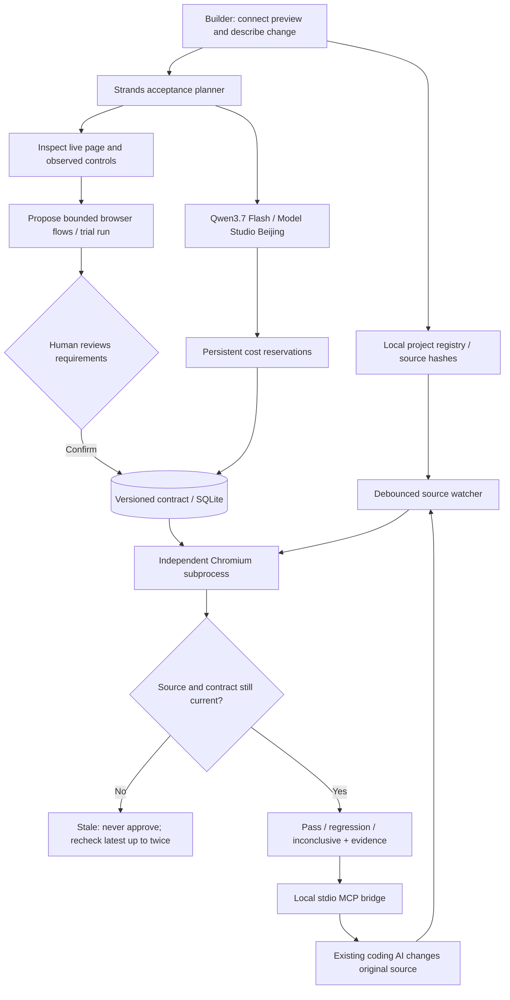

# LoopCheck 0.4 architecture

The real-project path never edits source. Strands observes the page, proposes structured steps, and invokes trial verification. Only the user's UI confirmation creates an active contract. Browser results determine acceptance; the model's summary cannot turn a failure into a pass.

`prepare_change`, `check_change`, `get_result` are the MCP surface. Authentication is scoped to one connected project, with credentials in ignored local storage. The bridge cannot confirm drafts. A result carries source and contract identifiers; concurrent edits invalidate it. Existing flows replay without a model request.

The native app binds to loopback by default. Each flow gets a fresh browser context. The worker has no provider key; requests are restricted to the connected origin. Frontend content is trusted local development material, not a hostile-code service. The public Docker mode disables local project connection and MCP, exposing only the provided fixture.

SQLite and screenshots require persistent storage. The watcher needs the server running. Public source, live deployment and video publishing remain separate release steps; AgentCore is not part of this implementation. The historical v0.3 repair demo remains at `/legacy`.
