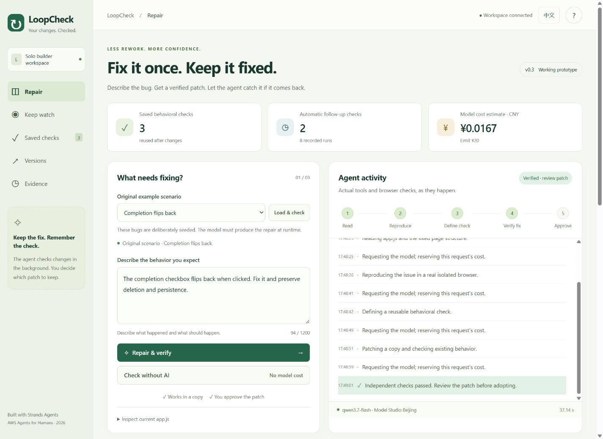
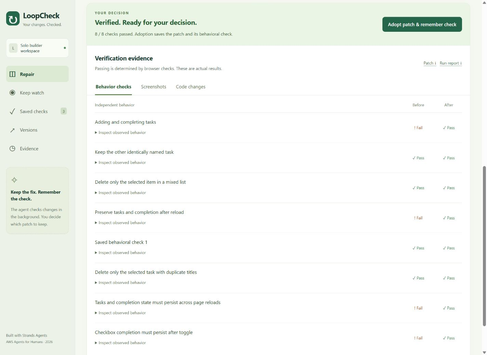
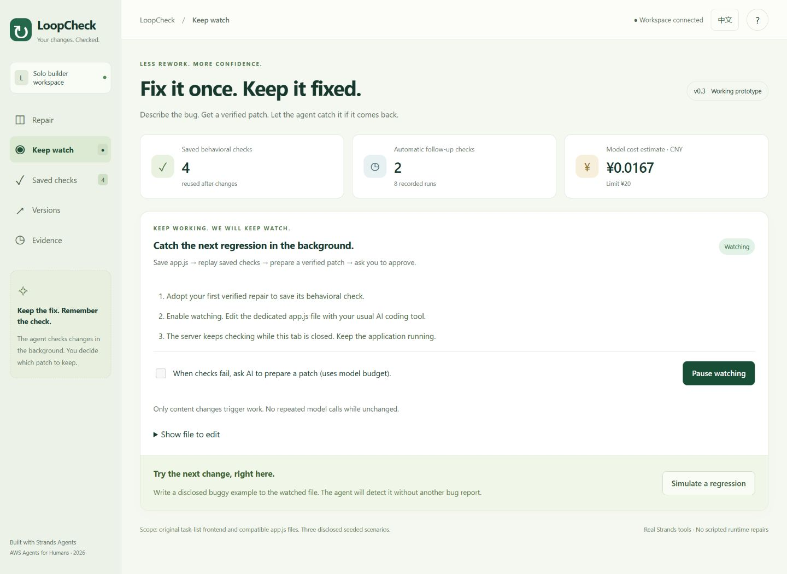

# LoopCheck 体验审查

2026-09-09，对实际运行页面进行截图后审查，范围为当前原创任务清单。结论：核心流程已可操作，三个场景与后台回归均有实际证据。尚未进行外部用户研究。

## 已完成的五步体验

1. **选择问题**：场景名、当前版本、故障描述和无模型检查入口都可见；刷新会恢复选择和描述，避免修错示例。
2. **执行修复**：工具日志、阶段、耗时和停止入口可见。首次真实失败暴露了工具参数和错误反馈问题，已修正。
3. **决定采用**：采用按钮前置；按行为查看失败/通过、浏览器前后图和代码差异；通过后才允许采用。
4. **持续复查**：采用后可保存要求、开启专用文件守护。后台结果主动提示；不会静默覆盖用户同时修改的文件。
5. **保留证据**：可下载报告、补丁和完整示例，筛选历史及恢复版本。

## 主要发现与处理

| 优先级 | 发现及影响 | 本轮处理 | 证据 |
| --- | --- | --- | --- |
| 高 | 真实模型无法稳定提交验收定义，导致失败 | 结构化工具参数并验证 Strands 入参 | 初次失败图 02、实际成功图 06 |
| 高 | 后续回归需要用户再次报告 | 增加实际文件监测与可选自动准备补丁 | 图 10、后台运行报告 |
| 中 | 结果较长，下一步不明显 | 将是否采用置于证据前 | 图 06 |
| 中 | 历史与成本容易混淆 | 明示真实请求、保留失败和模型费用 | 图 11 |
| 中 | 原界面文字和移动导航不够清晰 | 增大字体与点击区域，保留手机导航文字 | 图 04、05 |
| 中 | 静态资源缓存导致新旧界面混用 | 版本化资源地址和重新验证缓存头 | 最终重载验证 |
| 中 | 重载后选题与当前版本不符 | 恢复当前场景和问题描述 | 最终重载验证 |
| 低 | 演示暴露专用文件路径 | 默认折叠路径，公开模式隐藏路径 | 图 10 |

## 当前截图

手机截图见 [05-mobile.png](audit-v1/05-mobile.png)。1440×1050 和 390×844 两种视口未出现文档横向溢出；键盘切换标签和焦点环已验证。没有据此声明全面符合 WCAG。

## 尚存限制

- 面向指定任务清单结构，不能宣传成支持任意仓库。
- 当前示例数量不足以估算真实用户的修复成功率或效率提升。
- 模型与浏览器检查仍有等待时间，已给出过程和停止控制。
- 保存的中文要求在英文界面以通用名称显示，其操作步骤可阅读；下一版可增加用户可编辑的多语言名称。

